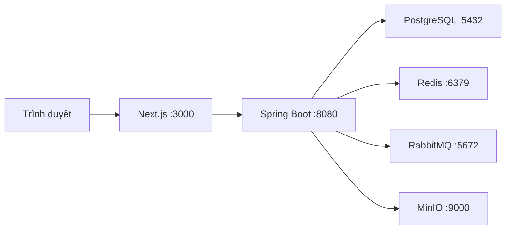

# Học cấu hình infra SmartEvent trên Windows

Hướng dẫn này dùng PowerShell, Docker Desktop chạy Linux containers, Java 17 và Node.js đã cài trên máy. Bắt đầu với hạ tầng local; phần cuối giải thích cấu hình mẫu VPS để bạn học trước khi mua máy chủ.

## 1. Mỗi repository làm gì?

```text
D:\SmartEventRepos\
├── smartevent-infra\       Docker Compose và cấu hình dịch vụ
├── smartevent-backend\     Spring Boot API và Flyway migrations
└── smartevent-web\         Next.js frontend
```

Luồng local:



Trong cấu hình local hiện tại, bốn dịch vụ hạ tầng chạy trong Docker. Backend và frontend được chạy riêng trên Windows.

| Dịch vụ    | Nhiệm vụ                                                | Địa chỉ local                                                            |
| ---------- | ------------------------------------------------------- | ------------------------------------------------------------------------ |
| PostgreSQL | Lưu tài khoản, sự kiện, đơn hàng và thông tin file      | `localhost:5432`                                                         |
| Redis      | Lưu trạng thái tạm và hỗ trợ các thao tác cần phối hợp  | `localhost:6379`                                                         |
| RabbitMQ   | Chuyển công việc xử lý bất đồng bộ, như thông báo/email | `localhost:5672`; giao diện quản lý: `http://localhost:15672`            |
| MinIO      | Lưu ảnh và file tải lên                                 | API: `http://localhost:9000`; giao diện quản lý: `http://localhost:9001` |

## 2. Đọc một dịch vụ trong Compose

Ví dụ rút gọn từ `docker-compose.yml`:

```yaml
minio:
  image: minio/minio
  command: server /data --console-address ":9001"
  environment:
    MINIO_ROOT_USER: ${MINIO_ROOT_USER}
    MINIO_ROOT_PASSWORD: ${MINIO_ROOT_PASSWORD}
  ports:
    - "127.0.0.1:9000:9000"
    - "127.0.0.1:9001:9001"
  volumes:
    - minio-data:/data
```

Đây là đoạn để đọc hiểu, không thay thế toàn bộ file Compose đang có.

- `image`: phần mềm Docker sẽ chạy. Cấu hình hiện tại chưa ghim phiên bản MinIO; cần chọn phiên bản/digest đã kiểm tra khi chuẩn bị triển khai thực tế.
- `command`: chạy MinIO, lưu dữ liệu ở `/data` trong container và mở giao diện quản lý ở cổng 9001.
- `environment`: truyền cấu hình vào dịch vụ. Compose lấy các giá trị `${...}` từ file môi trường hoặc shell.
- `ports`: thứ tự là **địa chỉ máy host : cổng máy host : cổng container**. `127.0.0.1` giới hạn truy cập vào máy hiện tại.
- `volumes`: gắn kho dữ liệu do Docker quản lý vào `/data`. Trong phần khai báo cuối file, `minio-data` có tên thực tế là `smartevent-minio-data`.
- `networks`: các container cùng mạng có thể gọi nhau bằng tên dịch vụ.
- `healthcheck`: kiểm tra dịch vụ đã sẵn sàng; có container đang chạy chưa chắc dịch vụ đã healthy.
- `restart: unless-stopped`: Docker có thể khởi động lại container khi cần, trừ khi bạn chủ động dừng.

Tài liệu gốc: [biến môi trường Compose](https://docs.docker.com/compose/how-tos/environment-variables/variable-interpolation/), [mạng Compose](https://docs.docker.com/compose/how-tos/networking/) và [Docker volumes](https://docs.docker.com/engine/storage/volumes/).

## 3. Chuẩn bị `.env` của infra

Mở Docker Desktop trước. Trong PowerShell:

```powershell
Set-Location -LiteralPath "D:\SmartEventRepos\smartevent-infra"
docker compose version

if (-not (Test-Path -LiteralPath ".env")) {
    Copy-Item -LiteralPath ".env.example" -Destination ".env"
}

notepad .env
```

Nếu đã có `.env` và hệ thống đang chạy, dùng cấu hình hiện tại. Đối với lần cài mới, giữ các tên/cổng mặc định và thay từng mật khẩu mẫu bằng mật khẩu riêng:

```dotenv
INFRA_BIND_ADDRESS=127.0.0.1

POSTGRES_DB=smart_event_db
POSTGRES_USER=smartevent
POSTGRES_PASSWORD=THAY_BANG_MAT_KHAU_DATABASE_RIENG
POSTGRES_PORT=5432

REDIS_PORT=6379

RABBITMQ_DEFAULT_USER=smartevent
RABBITMQ_DEFAULT_PASS=THAY_BANG_MAT_KHAU_RABBITMQ_RIENG
RABBITMQ_PORT=5672
RABBITMQ_MANAGEMENT_PORT=15672

MINIO_ROOT_USER=smartevent
MINIO_ROOT_PASSWORD=THAY_BANG_MAT_KHAU_MINIO_RIENG
MINIO_API_PORT=9000
MINIO_CONSOLE_PORT=9001
```

Có thể tự tạo một giá trị ngẫu nhiên bằng Node.js. Chạy riêng cho mỗi dịch vụ và chép kết quả vào file trên máy của bạn:

```powershell
node -e "console.log(require('node:crypto').randomBytes(32).toString('hex'))"
```

`.env` chứa cấu hình riêng của máy và đã được Git bỏ qua. `.env.example` là mẫu được commit.

**Đối với PostgreSQL đã có dữ liệu:** thay `POSTGRES_PASSWORD` trong `.env` không tự đổi mật khẩu trong database. Cần đổi mật khẩu database bằng thao tác quản trị tương ứng rồi cập nhật cấu hình ứng dụng; giữ nguyên dữ liệu khi học các bước này.

## 4. Kiểm tra và khởi động infra

Vẫn ở `smartevent-infra`:

```powershell
docker compose --env-file .env -f docker-compose.yml config --quiet
if ($LASTEXITCODE -ne 0) { throw "Cấu hình Compose chưa hợp lệ" }

docker compose --env-file .env -f docker-compose.yml up -d
if ($LASTEXITCODE -ne 0) { throw "Khởi động infra thất bại" }

docker compose --env-file .env -f docker-compose.yml ps
```

`config --quiet` chỉ kiểm tra cấu hình. `up -d` khởi động dịch vụ và để chúng chạy nền. Chờ cả PostgreSQL, Redis, RabbitMQ và MinIO hiển thị healthy trước khi chạy backend.

Xem log của dịch vụ có vấn đề:

```powershell
docker compose --env-file .env -f docker-compose.yml logs --tail=100 postgres
docker compose --env-file .env -f docker-compose.yml logs --tail=100 minio
```

Nếu cổng bị chiếm, đổi cổng host trong `.env` rồi cập nhật cổng kết nối tương ứng của backend. Ví dụ đổi `POSTGRES_PORT=5433` thì JDBC dùng `localhost:5433`; PostgreSQL trong container vẫn dùng cổng 5432.

## 5. Đồng bộ backend với infra

Tạo mẫu nếu chưa có file cấu hình backend:

```powershell
Set-Location -LiteralPath "D:\SmartEventRepos\smartevent-backend"
if (-not (Test-Path -LiteralPath ".env")) {
    Copy-Item -LiteralPath ".env.example" -Destination ".env"
}
notepad .env
```

Các giá trị cần khớp:

| Infra                            | Backend                                            |
| -------------------------------- | -------------------------------------------------- |
| `POSTGRES_DB` và `POSTGRES_PORT` | Tên database và cổng trong `SPRING_DATASOURCE_URL` |
| `POSTGRES_USER`                  | `SPRING_DATASOURCE_USERNAME`                       |
| `POSTGRES_PASSWORD`              | `SPRING_DATASOURCE_PASSWORD`                       |
| `RABBITMQ_DEFAULT_USER`          | `SPRING_RABBITMQ_USERNAME`                         |
| `RABBITMQ_DEFAULT_PASS`          | `SPRING_RABBITMQ_PASSWORD`                         |
| `RABBITMQ_PORT`                  | `SPRING_RABBITMQ_PORT`                             |
| `MINIO_ROOT_USER`                | `APP_MINIO_ACCESS_KEY`                             |
| `MINIO_ROOT_PASSWORD`            | `APP_MINIO_SECRET_KEY`                             |
| `MINIO_API_PORT`                 | Cổng trong `APP_MINIO_ENDPOINT`                    |
| `REDIS_PORT`                     | `SPRING_DATA_REDIS_PORT`                           |

Backend chạy trực tiếp trên Windows nên dùng:

```dotenv
SPRING_DATASOURCE_URL=jdbc:postgresql://localhost:5432/smart_event_db
SPRING_DATA_REDIS_HOST=localhost
SPRING_DATA_REDIS_PORT=6379
SPRING_RABBITMQ_HOST=localhost
SPRING_RABBITMQ_PORT=5672
APP_MINIO_ENDPOINT=http://localhost:9000
APP_MINIO_PUBLIC_ENDPOINT=
APP_MINIO_BUCKET=smart-event-bucket
CORS_ALLOWED_ORIGINS=http://localhost:3000
APP_MAIL_ENABLED=false
```

Để khớp giới hạn upload 10MB của StorageService, có thể thêm hai biến Spring Boot sau vào môi trường backend:

```dotenv
SPRING_SERVLET_MULTIPART_MAX_FILE_SIZE=10MB
SPRING_SERVLET_MULTIPART_MAX_REQUEST_SIZE=12MB
```

Tạo khóa JWT riêng bằng lệnh dưới rồi điền vào `JWT_SECRET` của backend. Mã backend yêu cầu Base64 giải mã được ít nhất 32 byte:

```powershell
node -e "console.log(require('node:crypto').randomBytes(32).toString('base64'))"
```

**Spring Boot/Gradle không tự đọc file `.env`.** Nếu chạy bằng IDE, đưa các biến này vào Run Configuration. Nếu chạy PowerShell, nạp file trước khi chạy Gradle. Đoạn sau dành cho mẫu `.env` dạng `KEY=value`, không có dấu nháy, nội suy biến hoặc comment cùng dòng:

```powershell
Get-Content -LiteralPath ".env" | ForEach-Object {
    $taskLine = $_.Trim()
    if ($taskLine -and -not $taskLine.StartsWith("#")) {
        $taskPair = $taskLine -split "=", 2
        if ($taskPair.Count -eq 2) {
            [Environment]::SetEnvironmentVariable(
                $taskPair[0].Trim(), $taskPair[1].Trim(), "Process"
            )
        }
    }
}

.\gradlew.bat bootRun
```

Chạy lệnh nạp biến và Gradle trong cùng cửa sổ PowerShell. Nếu backend đã được IDE chạy với môi trường đúng, tiếp tục dùng tiến trình đó.

Flyway trong backend quản lý schema và áp dụng migration còn thiếu. Infra cung cấp PostgreSQL; không chạy thêm một bộ SQL khởi tạo schema khác.

## 6. Frontend kết nối backend

Trong một cửa sổ PowerShell khác:

```powershell
Set-Location -LiteralPath "D:\SmartEventRepos\smartevent-web"
if (-not (Test-Path -LiteralPath ".env.local")) {
    Copy-Item -LiteralPath ".env.example" -Destination ".env.local"
}
```

Cấu hình local:

```dotenv
API_BASE_URL=http://localhost:8080
NEXT_PUBLIC_API_BASE_URL=http://localhost:8080
```

Nếu chưa cài dependencies, chạy `npm ci`, sau đó `npm run dev`. Nếu frontend đã chạy, dùng tiến trình hiện tại.

## 7. Bài thực hành về ảnh và volume

1. Mở MinIO Console và đăng nhập bằng thông tin trong `.env` infra.
2. Tải một ảnh sự kiện qua ứng dụng. Backend sẽ tạo bucket nếu cần, lưu object và lưu thông tin file vào PostgreSQL.
3. Kiểm tra ảnh xuất hiện trong bucket `smart-event-bucket`, theo đường dẫn `events/<eventId>/<uuid>.<extension>`.
4. Khi có thể tạm dừng công việc, dừng rồi khởi động lại infra bằng các lệnh dưới. Kiểm tra object vẫn tồn tại.

```powershell
Set-Location -LiteralPath "D:\SmartEventRepos\smartevent-infra"
docker compose --env-file .env -f docker-compose.yml down
docker compose --env-file .env -f docker-compose.yml up -d
```

Dữ liệu tồn tại nhờ named volumes. `down -v` xóa các volume, bao gồm database và ảnh. Volume giúp giữ dữ liệu qua vòng đời container; backup giúp phục hồi khi mất máy/ổ đĩa.

Favicon và banner trang login hiện nằm trong frontend, được đóng gói cùng frontend. Ảnh sự kiện tải lên qua API được lưu trong MinIO.

## 8. Điều gì đổi khi chuyển sang VPS?

| Nội dung                 | Local hiện tại                 | Mẫu VPS                                    |
| ------------------------ | ------------------------------ | ------------------------------------------ |
| Compose                  | `docker-compose.yml`           | `deploy/compose.demo.yml`                  |
| Backend/frontend         | Chạy trực tiếp trên máy        | Chạy trong Docker                          |
| Backend gọi PostgreSQL   | `localhost:5432`               | `postgres:5432`                            |
| Backend gọi MinIO        | `http://localhost:9000`        | `http://minio:9000`                        |
| Link ảnh cho trình duyệt | Endpoint local                 | `https://MEDIA_DOMAIN`                     |
| Điểm truy cập bên ngoài  | Các cổng loopback local        | Caddy cổng 80/443                          |
| Ảnh MinIO                | Volume `smartevent-minio-data` | Volume riêng của project `smartevent-demo` |
| HTTPS                    | Địa chỉ local                  | Caddy và DNS thật                          |

`localhost` bên trong container chỉ chính container đó. Các container cùng mạng dùng tên dịch vụ để tìm nhau; trình duyệt người dùng cần domain public. Vì vậy backend có endpoint MinIO nội bộ để upload và endpoint public để ký link ảnh.

Mẫu deploy dùng `APP_DOMAIN`, `MEDIA_DOMAIN`, `PORTFOLIO_DOMAIN` không có `https://` trong file `.env`. Caddy ghép cấu hình phục vụ các domain này. File `Caddyfile` đầy đủ còn yêu cầu thư mục portfolio `dist` ở cùng cấp với ba repo; portfolio hiện chưa có repo Git riêng.

Khi triển khai sau này, trình tự là: chuẩn bị môi trường riêng → khởi động dịch vụ nội bộ → kiểm tra backend/Flyway → khóa tài khoản seed → mở Caddy app/media → kiểm tra ảnh, tài khoản riêng và các callback public → chia sẻ bản demo. Kiểm thử ảnh qua public URL và callback VNPay cần proxy/domain public đã hoạt động.

Hai file Compose tạo các bộ volume riêng. Chuyển file Compose hoặc clone Git không tự chuyển database và ảnh; cần kế hoạch chuyển dữ liệu và backup tương ứng.

### Phạm vi mẫu deploy

Mẫu hiện tại phục vụ học và chuẩn bị demo. Trước khi vận hành với dữ liệu thật cần hoàn thành backup/restore, giới hạn và giám sát tài nguyên, phiên bản image đã kiểm tra, tài khoản ứng dụng có quyền phù hợp, chính sách đăng ký và cấu hình mail/payment thực tế.

MinIO cộng đồng hiện được chủ dự án thông báo **không còn được duy trì**. Khi chọn object storage cho vận hành lâu dài, cần xem lại tình trạng bảo trì; file mẫu đang có không tự giải quyết điều này. [Thông báo chính chủ](https://github.com/minio/minio).

Tham khảo: [chuẩn bị VPS demo](../../deploy/README.md), [Docker Engine trên Ubuntu](https://docs.docker.com/engine/install/ubuntu/), [Caddy automatic HTTPS](https://caddyserver.com/docs/automatic-https), [thuộc tính Spring Boot multipart](https://docs.spring.io/spring-boot/4.0/appendix/application-properties/index.html).
