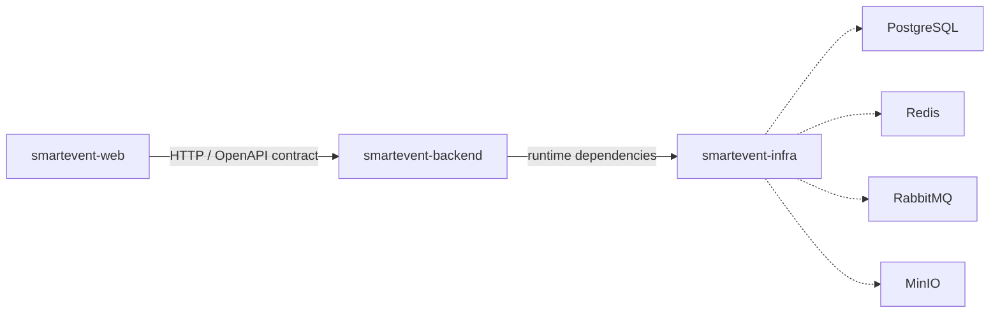

# Repository boundaries

## Mục tiêu

Ba repository được tách theo vòng đời thay đổi và trách nhiệm sở hữu, không phải theo từng thư mục kỹ thuật nhỏ. Cách chia này đủ rõ cho đồ án, dễ CI/CD và chưa tạo gánh nặng microservice.

| Thành phần | Backend | Web | Infra |
|---|:---:|:---:|:---:|
| Java/Spring Boot và nghiệp vụ | ✓ |  |  |
| Flyway migration và database contract | ✓ |  |  |
| OpenAPI source | ✓ | tiêu thụ |  |
| Next.js, UI và client state |  | ✓ |  |
| Docker Compose cho dịch vụ dùng chung |  |  | ✓ |
| PostgreSQL/Redis/RabbitMQ/MinIO local |  |  | ✓ |
| Secret thật |  |  | không repository nào |

## Quy tắc phối hợp

1. Thay đổi API breaking phải cập nhật OpenAPI và frontend trong các pull request có liên kết chéo.
2. Flyway migration chỉ được thêm trong backend; infra không duy trì schema SQL song song.
3. Mỗi repository tự chạy lint/test/build của mình trước khi merge.
4. Không dùng Git submodule hoặc subtree để ghép lại mã nguồn. Khi phát triển local, clone ba repository cạnh nhau.
5. Release có thể độc lập; khi cần demo đồng bộ, ghi rõ commit SHA của cả ba repository trong release note.

## Luồng dependency

Backend phụ thuộc hạ tầng khi chạy, nhưng infra không import mã nguồn backend. Điều này giữ hướng phụ thuộc một chiều và tránh tái tạo monorepo bằng liên kết Git ngầm.

